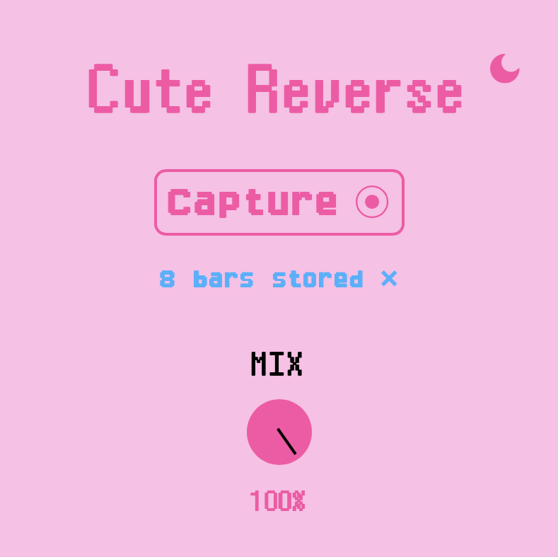

# Cute Reverse

Cute Reverse is a real reversing VST plugin, meaning that it sounds the same as rendering the audio and 
reversing manually.

### Usage:

The plugin requires recording audio into it, since the reverse effect needs to know the future audio.

The plugin only records when a loop region in your DAW is active. 

Select a loop region, and press "Capture" in the plugin. 

Start playing the audio inside the loop, the capture will automatically finish once the loop wraps back around.

The reversed audio should begin playing immediately, and you can crossfade between the forward and reversed audio using the mix knob.

Whenever you update the forward audio signal you should re-record the reverse audio following the same process.

### Design

Our design is available here: https://www.figma.com/design/OcWsDiYm55Hmlzvfr0JizV/Cute-Reverse

### Purchase

### See Also

- [Cute Stop](https://github.com/Moebytes/Cute-Stop) 
- [Cute Pitch](https://github.com/Moebytes/Cute-Pitch)